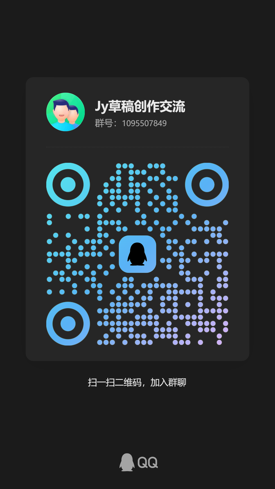

<div align="center">

# HDraft · Batch Render Jianying / CapCut Drafts

**Turn "export drafts one by one in CapCut" into a single command.**

Your drafts already live in CapCut's project folder — but exporting them means clicking
through each one and waiting. HDraft reads draft projects directly, decrypts them,
collects assets, uploads them, renders in the cloud concurrently, and writes the
finished video back next to the draft.

[](https://github.com/HTWMedia/JyDraft/releases)
[](https://github.com/HTWMedia/JyDraft/releases)
[](https://github.com/HTWMedia/JyDraft/releases)

English ｜ [简体中文](README.md) ｜ [Download](https://github.com/HTWMedia/JyDraft/releases)

</div>

---

## Why it exists

CapCut (Jianying) is great for editing — and painful for batch exporting:

| Today | With HDraft |
| --- | --- |
| Open CapCut → open draft → export → wait → next one | List your drafts, run one command, walk away |
| One export at a time, babysitting the progress bar | Multiple drafts processed concurrently |
| Export maxes out your CPU / GPU | Rendering happens in the cloud; your machine only packs and uploads |
| Batching, scheduling, or integrating is nearly impossible | CLI + HTTP API — scriptable and composable by design |

**Good for**: daily matrix accounts (dozens of similar drafts per batch), templated
mass production, wiring rendering into your own pipeline, or rendering on a machine
that has no CapCut installed at all.

---

## 30-second start

### 1. Download

Grab the archive for your platform from
[Releases](https://github.com/HTWMedia/JyDraft/releases) and unzip — no installer:

| Platform | File |
| --- | --- |
| Windows x64 | `HDraft_win-x64.zip` |
| macOS Intel | `HDraft_osx-x64.zip` |
| macOS Apple Silicon | `HDraft_osx-arm64.zip` |

### 2. Get an AuthKey

Visit <https://htwmedia.dpdns.org/Home/GetApiKey>, enter your email, and the key is
mailed to you. The AuthKey is only an **anti-abuse gate** — new accounts start with a
1-month free quota.

### 3. Point it at your drafts

Edit `config.ini` next to the executable:

```ini
(!do not delete this line)  DraftPath：C:\Users\you\AppData\Local\JianyingPro\User Data\Projects\com.lveditor.draft\Feb-09\draft_content.json
authKey:your-key
```

- Separate multiple drafts with a pipe `|`;
- You can also pass a **folder** — HDraft scans its subdirectories for drafts;
- Keep the `(!do not delete this line)` marker at the start of the first line.

> Prefer not to edit files? Just run `HDraft` and type the AuthKey and draft paths
> when prompted.

### 4. Run

```bash
HDraft          # start processing
HDraft --help   # usage
```

Each step is printed so you can follow along. Finished videos land in the **draft's own
folder**, named like `生成视频_20260209_153012.mp4`.

---

## What actually happens

```
Draft project folder
   │  ① read draft_content.json (auto-decrypt if encrypted)
   │  ② parse the draft, collect referenced video / image / audio assets
   │  ③ convert GIFs to their first PNG frame
   ▼
Upload assets to the cloud (local machine only packs; 4-way concurrency)
   ▼
④ Cloud rendering: create task → poll progress
   ▼
⑤ Download the result → write next to the draft → clean up temp files
```

Details you may care about:

- **Encrypted drafts are handled for you** — CapCut encrypts drafts since 5.9; no manual step;
- **Drafts don't have to come from CapCut** — a generated `draft_content.json` renders just as well (see below);
- **Your machine stays usable** — rendering is cloud-side; once upload finishes you can close the window;
- **Assets are not retained** — temporary cloud assets are deleted when the task ends.

---

## Where drafts come from

### ① Reuse your CapCut project drafts (most common)

Default location on Windows:

```
C:\Users\<you>\AppData\Local\JianyingPro\User Data\Projects\com.lveditor.draft\<draft-name>\draft_content.json
```

Not sure? Right-click the draft in CapCut → "Open draft folder".

### ② Generate drafts from code (batching / templating)

The C# sources at the repo root (`ScriptFile.cs`, `VideoSegment.cs`, `AudioSegment.cs`, …)
form a lightweight draft-generation library — you can assemble a whole video without
ever opening CapCut:

```csharp
var script = new ScriptFile(1920, 1080);          // canvas size
script.Content["id"] = draftId;

script.AddTrack(TrackTypeName.audio)
      .AddTrack(TrackTypeName.video)
      .AddTrack(TrackTypeName.text);

var audioSegment = new AudioSegment(
    new AudioMaterial(@"D:\assets\audio.mp3"),
    TimeUtil.Trange(0, "5s"),
    volume: 0.6f);
audioSegment.AddFade("1s", 0);                    // fade in

var videoSegment = new VideoSegment(
    new VideoMaterial(@"D:\assets\video.mp4"),
    TimeUtil.Trange(0, "4.2s"));
videoSegment.AddAnimation(IntroType.斜切);        // intro animation
videoSegment.AddTransition(TransitionType.信号故障); // transition

var textSegment = new TextSegment(
    "Heard HDraft works pretty well?",
    videoSegment.TargetTimerange,
    font: FontType.文轩体,
    style: new TextStyle(color: new[] { 1.0f, 1.0f, 0.0f }),
    clipSettings: new ClipSettings(transformY: -0.8f));

script.AddSegment(audioSegment)
      .AddSegment(videoSegment)
      .AddSegment(textSegment);

var json = script.Dumps();                        // write out as draft_content.json
```

Supported: audio / video / image / GIF / text tracks and segments, keyframes,
transitions, animations, subtitle bubbles, background filling, filters and effects
(metadata for effects lives under `meta/`).

### ③ Decrypt an encrypted draft

If all you have is an encrypted `draft_content.json` and you want to inspect or tweak it
before rendering, call the `DecryptDraft` endpoint (see integration below) to get
plaintext JSON back.

---

## Integrating it

The CLI covers most cases. If you want to embed rendering into your own platform,
schedule it, or build on top of it, use the HTTP API. Every request carries the header
`AuthKey: <your key>` (`X-API-KEY` also accepted).

### Simple flow: upload a ZIP

Best when the package is small and you want the fewest lines of code.

| Step | Endpoint | Notes |
| --- | --- | --- |
| 1 | `POST /Home/UploadDraftPackage` | `multipart/form-data` ZIP containing `draft_content.json` + all assets |
| 2 | `POST /Home/StartRender?draftId={id}` | Starts rendering, returns `taskId` |
| 3 | `GET /Home/GetStatus?taskId={id}` | Poll `Status` / `Progress` / `DownloadUrl` |

ZIP layout (asset paths must match the references inside the JSON):

```
my_draft.zip
├── draft_content.json
├── video.mp4
├── audio.mp3
└── image.png
```

### Chunked flow: upload assets one by one (what HDraft itself uses)

Better for large files, instant-upload dedupe, resumable transfers, or when you manage
assets yourself.

```text
POST /Home/CreateAssetUpload   { md5, size, crc32, filename, file_type } → upload_id / space_id / token
      ↓ stream bytes to cloud storage
POST /Home/CommitAssetUpload   { upload_id, space_id, md5, filename, size } → asset_id
      ↓ (repeat for every asset)
POST /Home/SaveDraft           { draftJson, title, packageAssets } → draftId
POST /Home/RenderDraft         { draftId } → taskId
GET  /Home/GetStatus?taskId=…  → Status / Progress / DownloadUrl
```

`GetStatus` response example:

```json
{ "Status": "completed", "Progress": 100, "DownloadUrl": "https://..." }
```

### Other endpoints

| Endpoint | Method | Notes |
| --- | --- | --- |
| `/Home/GetApiKey` | GET | Web page to request an AuthKey (recommended) |
| `/auth/applykey?email=` | POST | Request an AuthKey via API (sent by email) |
| `/Home/DecryptDraft` | POST | Upload an encrypted draft JSON via `multipart/form-data`, get plaintext `draft_content` |

> The API keeps evolving — trust the actual response over this page. Questions welcome as issues.

---

## FAQ

<details>
<summary><b>Do I need CapCut installed?</b></summary>

No. HDraft reads CapCut's draft project files and renders in the cloud, so it runs fine
on machines — or servers — without CapCut.
</details>

<details>
<summary><b>How do I find my draft path?</b></summary>

Right-click the draft in CapCut → "Open draft folder"; `draft_content.json` is inside.
You can also put a **folder path** into `config.ini` and HDraft will scan subdirectories.
</details>

<details>
<summary><b>It says assets are missing / my render is missing clips?</b></summary>

Referenced assets must still exist and be readable. Moving assets or switching machines
is the usual cause — open the draft once in CapCut to confirm it previews, then hand it
to HDraft.
</details>

<details>
<summary><b>How many run in parallel? How long does it take?</b></summary>

4-way concurrency by default. Per-video time depends on cloud queue and clip length; in
batch scenarios the total is usually far faster than exporting by hand.
</details>

<details>
<summary><b>Where do the videos go?</b></summary>

Into the **draft's own folder**, named like `生成视频_<timestamp>.mp4`.
</details>

<details>
<summary><b>Are my assets kept?</b></summary>

No. Assets are used only during rendering and deleted when the task ends (success or
failure); local temp files are cleaned up too.
</details>

## Error codes

| Code | Meaning | What to do |
| --- | --- | --- |
| 401 | AuthKey missing or invalid | Re-request and fill it in |
| 402 | Free quota exhausted | Top up on the platform and retry |
| 400 | Bad request parameters | Check draft package structure and fields |
| 500 | Internal server error | Retry; open an issue if it persists |

---

## Related

- [HTWMedia/HTWClient](https://github.com/HTWMedia/HTWClient) — the open-source desktop
  client covering the full loop: topic research → creation → editing → multi-platform
  publishing. Use HDraft when all you need is batch draft exporting; use HTWClient for
  the whole workbench.

## Contributing

Issues and PRs welcome. The draft-generation library lives at the repo root — if you
discover new draft fields or effect parameters, please contribute them to `meta/`.

## Community

Interested in CapCut / Jianying draft internals, encryption, or automated rendering
pipelines? Join the chat:



> Technical discussion only — no advertising, please.

## License

For learning and technical research only. Do not use it in any way that violates the
CapCut / Jianying terms of service or applicable law.
